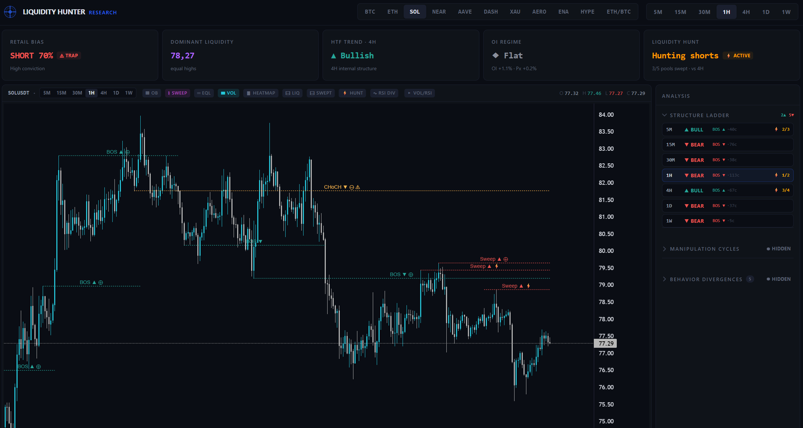

# liquidity-hunter

A research platform for market liquidity detection and market psychology
analysis on crypto markets. It answers questions like *where is the resting
liquidity, who is trapped, and which side is the fuel for the next move* —
purely as **descriptive observations**.

This project is **not** a trading system: it produces no buy/sell signals
and contains no order execution, position management, or strategy logic.



## What it detects

- **Market structure (SMC)** — BOS / CHoCH / failed CHoCH / liquidity
  sweeps via a close-confirmed, persistence-gated state machine
  (`InternalStructureDetector`), with provisional live-edge marks
  (`BOS?` / `CHoCH?`) and a conservative composition pass that re-times
  every BOS to its confirming close. See
  [`liquidity_hunter/docs/estrutura_bos_choch.md`](liquidity_hunter/docs/estrutura_bos_choch.md)
  (Portuguese) for the full walkthrough.
- **Liquidity zones** — swing points and equal highs/lows, ranked as
  liquidity targets by a composite score
  ([`docs/scoring.md`](liquidity_hunter/docs/scoring.md)).
- **POI zones** — MSB-anchored order blocks / breaker blocks / mitigation
  blocks (a faithful batch port of EmreKb's "Market Structure Break &
  Order Block" TradingView indicator, verified against its on-chart boxes).
- **Manipulation cycles** — three-phase Wyckoff/SMC patterns
  (accumulation → sweep → expansion), retrospective and prospective.
- **Behavior divergences** — volume-delta vs. price divergences
  (distribution, accumulation, exhaustion, absorption).
- **Leverage liquidation map** — a "gravitational map" of where leveraged
  retail positions would be force-liquidated, inferred from open interest,
  funding, and long/short positioning (Binance perpetual futures).
- **OI regime** — the price × open-interest matrix (long/short buildup,
  short covering, long liquidation) plus per-event OI qualification of
  structure breaks (new money / covering / liquidation flush).
- **Liquidity hunt state** — when the current timeframe's structure runs
  counter to the higher timeframe, the counter-trend entrants become the
  resting liquidity: which pools are mapped, which were captured, and
  whether the hunt has concluded.
- **Retail crowd psychology** — a rule-based estimate of what retail is
  likely doing ([`docs/psychology.md`](liquidity_hunter/docs/psychology.md)).
- **Multi-timeframe structure ladder** — one standing state per timeframe
  (M5 → W1): trend, last structural event, forming marks, hunt phase.

## Methodology

Detector changes are validated by **measurement, not intuition**: every
behavioral flag was measured across a matrix of assets × timeframes
(BTC/ETH/SOL/AAVE/NEAR × 5m..1d) before being wired into production, ships
with a real-data regression fixture reproducing its motivating case
(`liquidity_hunter/tests/liquidity/detectors/data/`), and is byte-for-byte
inert when disabled. Live-edge (provisional) marks are evaluated by
walk-forward replay — e.g. 85% of provisional BOS marks confirm, with a
~11-candle median lead. Several plausible alternatives were rejected
because measurement showed they cascaded (see the design notes in
`CLAUDE.md`).

## Architecture

Clean architecture: dependencies flow inward only, toward a
framework-agnostic domain core.

```
        app ◄── api
         │
 ┌───────┼────────────┐
 │       │            │
liquidity  psychology │
 │       │            │
 indicators           │
 │       │            │
 └───►  data ◄────────┘
         │
        core (domain)
```

| Layer        | Responsibility                                                              |
|--------------|------------------------------------------------------------------------------|
| `core`       | Framework-agnostic, immutable domain entities (`Candle`, `LiquidityZone`, `MarketStructure`, `POIZone`, `ManipulationCycle`, `LeverageLiquidationMap`, `LiquidityHuntState`, ...) and shared enums |
| `data`       | Market data acquisition (Binance spot + USDT-M perpetual futures via CCXT, with fallback chaining, retries, and OI pagination) |
| `indicators` | Stateless derived series computed from `Candle` data (volume delta)         |
| `liquidity`  | Detection/modeling of `LiquidityZone`, `MarketStructure`, and `POIZone`     |
| `psychology` | Retail bias, manipulation cycles, behavior divergences, liquidation map, OI regime |
| `scoring`    | Composite, descriptive scoring of liquidity zones                            |
| `app`        | Composition root (`load_dashboard_data`), narrative & liquidity-hunt synthesis, multi-timeframe overview |
| `api`        | FastAPI presentation of `app` output as JSON                                 |
| `config`     | Application settings (environment-driven, via `pydantic-settings`)          |

See [`liquidity_hunter/docs/architecture.md`](liquidity_hunter/docs/architecture.md)
for the full rationale.

## Setup

Requires Python 3.12 and [Poetry](https://python-poetry.org/).

```bash
poetry install
```

## Running

### API

```bash
poetry run uvicorn liquidity_hunter.api.main:app --reload
```

#### Endpoints

- `GET /api/health` — liveness check.
- `GET /api/dashboard` — a full `DashboardData` snapshot (candles, zones,
  structure events, POI zones, manipulation cycles, divergences,
  liquidation map, OI analysis, liquidity hunt state) as JSON.

  | Parameter        | Type    | Default   | Notes                                        |
  |------------------|---------|-----------|-----------------------------------------------|
  | `symbol`         | string  | `BTCUSDT` |                                               |
  | `timeframe`      | string  | `1h`      | `1m`, `5m`, `15m`, `30m`, `1h`, `4h`, `1d`, `1w` |
  | `limit`          | integer | `1200`    | Visible candles, `1`–`1200`                   |
  | `swing_lookback` | integer | `10`      | Major (swing) structure detector lookback     |
  | `narrative`      | boolean | `false`   | Enables the narrative/anomaly synthesis       |

  Responses are cached in-memory per parameter combination for 10 seconds.

  ```bash
  curl "http://127.0.0.1:8000/api/dashboard?symbol=SOLUSDT&timeframe=1h"
  ```

- `GET /api/overview?symbol=BTCUSDT` — the multi-timeframe structure
  ladder (M5 → W1): per-timeframe trend, last structural event, forming
  provisional marks, and liquidity-hunt phase. Snapshots are cached per
  timeframe with proportional TTLs (M5=30s ... W1=20min).

Candles come from Binance USDT-M perpetual futures by default (aligned
with the OI/funding/liquidation overlays), falling back to spot for
symbols without a perpetual contract. Futures-state fetch failures degrade
gracefully (`liquidation_map`/`oi_analysis` become `null`) instead of
failing the snapshot.

### React frontend

A React + TypeScript + Vite frontend (`frontend/`, Tailwind CSS +
[Lightweight Charts](https://tradingview.github.io/lightweight-charts/))
renders a dark, TradingView-style research terminal: KPI row (retail bias,
dominant liquidity, HTF trend, OI regime, liquidity hunt), main chart with
volume-delta and RSI panes, BOS/CHoCH/sweep lines, POI boxes, liquidation
bands, hunt-window shading, and the structure ladder sidebar.

With the API running, in a separate terminal:

```bash
cd frontend
npm install
npm run dev    # proxies /api -> http://127.0.0.1:8000
```

## Library usage

Everything the API serves is available as a library:

```python
from liquidity_hunter.app import load_dashboard_data
from liquidity_hunter.core.domain import TimeFrame

data = load_dashboard_data(symbol="BTCUSDT", timeframe=TimeFrame.H1)
for event in data.internal_structure_events:
    print(event.timestamp, event.event, event.direction, event.price_level)
```

Lower-level building blocks (providers, detectors, analyzers, scoring) are
importable from their layer packages — runnable examples live in
`liquidity_hunter/app/examples/`:

```bash
poetry run python -m liquidity_hunter.app.examples.fetch_btcusdt_1h
poetry run python -m liquidity_hunter.app.examples.detect_btcusdt_liquidity
poetry run python -m liquidity_hunter.app.examples.score_btcusdt_liquidity
poetry run python -m liquidity_hunter.app.examples.estimate_btcusdt_retail_bias
```

## Development

```bash
poetry run pytest              # all tests
poetry run ruff check .        # lint
poetry run mypy liquidity_hunter  # type-check (strict mode)
```

Tests mirror the package layout 1:1 under `liquidity_hunter/tests`, and
detector behavior is pinned by regression fixtures built from real market
data (`liquidity_hunter/tests/liquidity/detectors/data/`).

### Frontend

```bash
cd frontend
npx tsc -b      # type-check
npm run lint    # eslint
npm run build   # production build
```

## Documentation

- [`docs/architecture.md`](liquidity_hunter/docs/architecture.md) — layering and SOLID rationale.
- [`docs/estrutura_bos_choch.md`](liquidity_hunter/docs/estrutura_bos_choch.md) — the BOS/CHoCH detection pipeline, end to end (Portuguese).
- [`docs/scoring.md`](liquidity_hunter/docs/scoring.md) — liquidity zone scoring methodology.
- [`docs/psychology.md`](liquidity_hunter/docs/psychology.md) — retail crowd psychology estimation.
- `CLAUDE.md` — the living design log: every detector flag, its motivating
  case, the measurement that validated it, and the alternatives rejected.

## License

[MIT](LICENSE)
